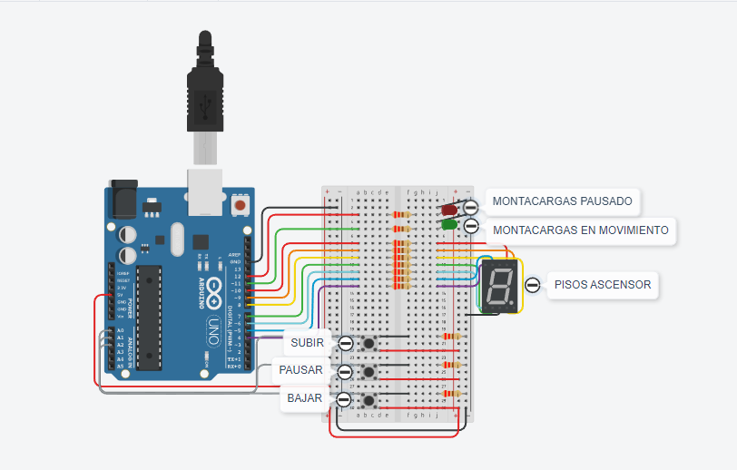
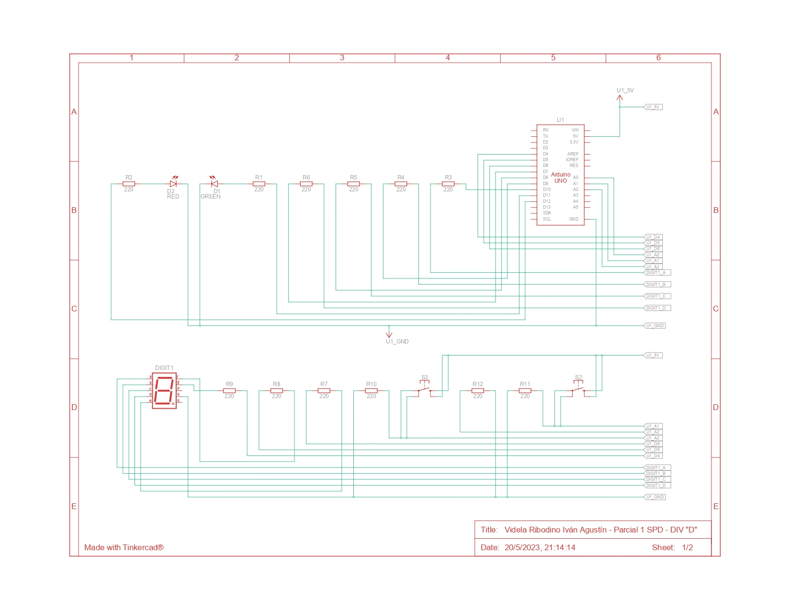
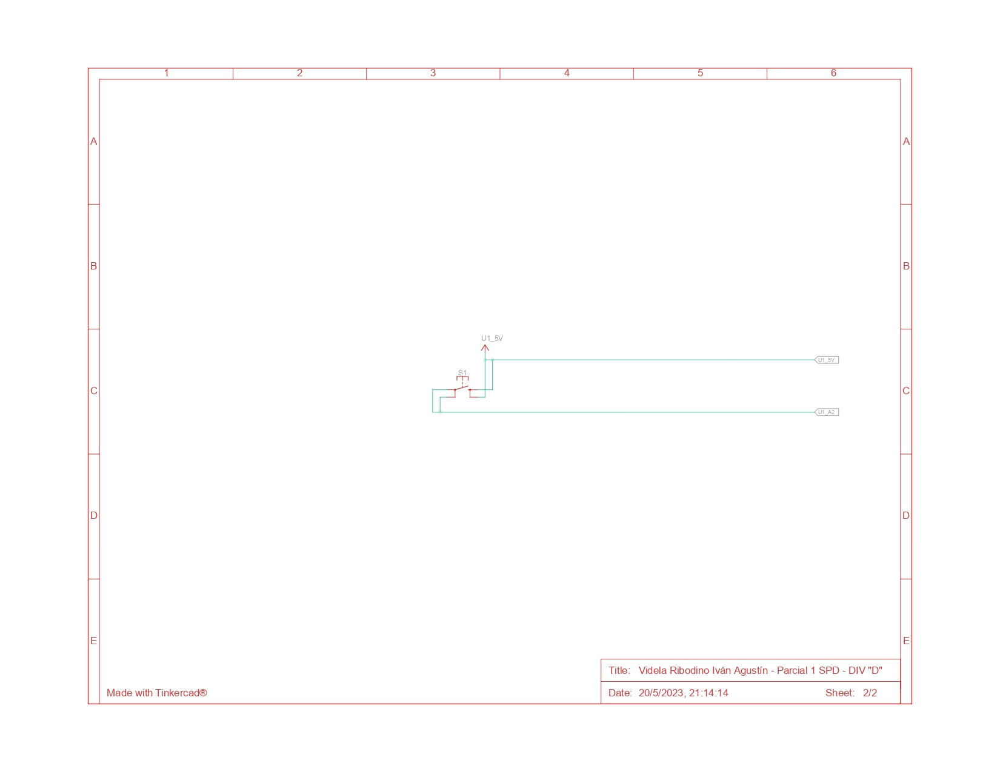

# PARCIAL 1 SPD - PARTE PRÁCTICA DOMICILIARIA - VIDELA R. IVÁN A.

## Proyecto: Montacargas

## Descripción 

Se nos pide armar un modelo de montacarga funcional como maqueta para un hospital. El
objetivo es que implementes un sistema que pueda recibir ordenes de subir, bajar o pausar
desde diferentes pisos y muestre el estado actual del montacargas en el display 7
segmentos.

### Requisitos del Proyecto:

1. Interfaz de usuario:
- Deberá haber 3 botones, uno para subir pisos, otro para bajar pisos y otro para detener el montacarga.
- Deberá tener 2 LEDs, uno verde que indicará cuando el montacarga este en movimiento, otro rojo que indique cuando el montacarga esté pausado.
- En el display 7 segmentos deberán informar en tiempo real en qué piso se encuentra el elevador.
- Se sabe que el tiempo de trayecto entre pisos es de 3 segundos (3000 ms).
- Se deberá informar por monitor serial el piso en el que se encuentra el montacarga, este en funcionamiento o en pausa.

2. Funcionamiento del montacarga:
- Implementa un algoritmo que permita que el elevador suba y baje o frene presionando los botones correspondientes.
- Deberán buscar una forma para pausar el montacargas cuando el usuario lo determine.

3. Documentación:
- Deberán presentar un diagrama esquemático del circuito y explicar el funcionamiento aplicado de cada componente.
- Presentar el código fuente del proyecto de Arduino listo para ser implementado.
- Deberán explicar el funcionamiento integral utilizando documentación MarkDown.

## Diagrama esquemático del circuito

### Funcionamiento aplicado de cada componente: 

#### LEDS:
- D1 GREEN (LED Verde): El ánodo del LED está conectado a una resistencia (R1) de 220 Ohms y a la salida digital D11 del Arduino Uno (U1). El cátodo está conectado a GND (tierra) del U1. Cuando la salida digital D11 está en estado alto (HIGH/1), se aplica un voltaje a través del LED, lo que lo enciende y emite luz verde, si está en estado bajo (LOW/0) no se le aplica voltaje, lo que lo apaga y no emite luz.
- D2 RED (LED Roja): El ánodo del LED está conectado a una resistencia (R2) de 220 Ohms y a la salida digital D12 del Arduino Uno (U1) El cátodo está conectado a GND (tierra) del U1. Cuando la salida digital D12 está en estado alto (HIGH/1), se aplica un voltaje a través del LED, lo que lo enciende y emite luz roja, si está en estado bajo (LOW/0) no se le aplica voltaje, lo que lo apaga y no emite luz.

#### VISUALIZADOR 7 SEGMENTOS - DIGIT 1:
El visualizador consta de 7 segmentos (A-G), que se encienden para formar diferentes números o caracteres, para mostrarlos se encienden los segmentos correspondientes (HIGH/1) o apagan (LOW/0).
- a = Segmento "A" conectado con una resistencia (R3) de 220 ohms al pin D10 (salida digital) del Arduino Uno (U1).
- b = Segmento "B" conectado con una resistencia (R4) de 220 ohms al pin D9 (salida digital) del Arduino Uno (U1).
- c = Segmento "C" conectado con una resistencia (R5) de 220 ohms al pin D8 (salida digital) del Arduino Uno (U1).
- d = Segmento "D" conectado con una resistencia (R6) de 220 ohms al pin D7 (salida digital) del Arduino Uno (U1).
- e = Segmento "E" conectado con una resistencia (R7) de 220 ohms al pin D6 (salida digital) del Arduino Uno (U1).
- f = Segmento "F" conectado con una resistencia (R8) de 220 ohms al pin D5 (salida digital) del Arduino Uno (U1).
- g = Segmento "G" conectado con una resistencia (R9) de 220 ohms al pin D4 (salida digital) del Arduino Uno (U1).
- K = "Común" conectado a GND (tierra) del Arduino Uno (U1).

##### PULSADORES:
- S3 = Utiliza una configuración pull down, es decir que al ser presionado la entrada analógica correspondiente detecta un cambio de voltaje. (HIGH/1). Terminal 2b conectada a 5V del U1 - Terminal 1b conectada con una resistencia (R10) de 220 ohms a GND (tierra) del U1 - Terminal 1a conectada al pin A0 (entrada analógica) del Arduino Uno (U1).
- S2 = Se utiliza una configuración pull down, al igual que en S3. Terminal 2b conectada a 5V del U1 - Terminal 1b conectada con una resistencia (R11) de 220 ohms a GND (tierra) del U1 - Terminal 1a conectada al pin A1 (entrada analógica) del Arduino Uno (U1).
- S1 = Se utiliza una configuración pull down, al igual que en S3. Terminal 2b conectada a 5V del U1 - Terminal 1b conectada con una resistencia (R12) de 220 ohms a GND (tierra) del U1 - Terminal 1a conectada al pin A2 (entrada analógica) del Arduino Uno (U1).

## Función principal

El código hace uso de varias funciones para controlar el visualizador 7 segmentos, las leds y los pulsadores. La función cambiarEstadoMontacargas se encarga de cambiar el estado del montacargas al presionar el pulsador correspondiente, además de mostrar en pantalla el estado actual del montacargas.

~~~ C (lenguaje en el que esta escrito)
void cambiarEstadoMontacargas()
{
    int estadoPulsadorSubir = digitalRead(PULSADOR_SUBIR); 
    int estadoPulsadorBajar = digitalRead(PULSADOR_BAJAR); 
    int estadoPulsadorPausar = digitalRead(PULSADOR_PAUSAR);
    
    if(estadoPulsadorPausar == HIGH)
    {
        if(sistemaPausado == false)
        {
            Serial.println("MONTACARGAS PAUSADO");
        }
        sistemaSubiendo = false;
        sistemaBajando = false;
        sistemaPausado = true;
    }
    else
    {
        if(estadoPulsadorSubir == HIGH)
        {
            if(sistemaSubiendo == false)
            {
                Serial.println("MONTACARGAS SUBIENDO");
            }
            sistemaPausado = false;
            sistemaBajando = false;
            sistemaSubiendo = true;
        }
        else
        {
            if(estadoPulsadorBajar == HIGH)
            {
                if(sistemaBajando == false)
                {
                    Serial.println("MONTACARGAS BAJANDO");
                }
                sistemaPausado = false;
                sistemaSubiendo = false;
                sistemaBajando = true;
            }
        }
    }
}
~~~
### Otras Funciones

La función subirBajarPisos se encarga de incrementar o decrementar el valor del piso actual (piso) dependiendo del estado del sistema. Si el montacargas está subiendo y no llegó al piso máximo el piso se incrementa, si el montacargas está bajando y no llegó al piso mínimo el piso se decrementa. Si no se cumplen estas opciones quiere decir que se llegó al piso máximo o mínimo entonces pausa el montacargas y muestra el mensaje por el serial.

~~~ C (lenguaje en el que esta escrito)
void subirBajarPisos()
{
    if(sistemaSubiendo == true and piso != 9)
    {
        piso++;
    }
    else
    {
        if(sistemaBajando == true and piso != 0)
        {
            piso--;
        }
        else
        {
            sistemaPausado = true;
            Serial.println("MONTACARGAS PAUSADO");
        }
    }
}
~~~

La función permitirCambioPisosPorTiempo permite cambiar de piso cada cierto intervalo de tiempo, el pasado por parámetro, en este caso el trayecto entre pisos va a ser de 3000 ms. Para que pueda leer en cualquier momento de ejecución del programa que el pulsador se haya pulsado, se hace uso del ciclo for, para cada intervalo de 50 ms, chequear si se presionó algún pulsador, para ello se hace llamado a la función cambiarEstadoMontacargas.

~~~ C (lenguaje en el que esta escrito)
void permitirCambioPisosPorTiempo(int tiempo)
{
    for(int i = 0; i < tiempo; i+=50)
    {
        delay(50);
        cambiarEstadoMontacargas();
    }
}
~~~

Las funciones prenderLed y apagarLed prenden o apagan la led correspondiente pasada por parámetro solo si esta led ya se encuentra prendida o apagada, además avisan que color de led fue prendido o apagado.

~~~ C (lenguaje en el que esta escrito)
void prenderLed(int led)
{
    switch(led)
    {
        case LED_ROJO:
            if(ledRojoPrendido == false)
            {
                Serial.println("Led Rojo prendido");
                ledRojoPrendido = true;
                digitalWrite(led, HIGH);
            }
        break;
        case LED_VERDE:
            if(ledVerdePrendido == false)
            {
                Serial.println("Led Verde prendido");
                ledVerdePrendido = true;
                digitalWrite(led, HIGH);
            }
        break;
    }
}

void apagarLed(int led)
{
    switch(led)
    {
        case LED_ROJO:
            if(ledRojoPrendido == true)
            {
                Serial.println("Led Rojo apagado");
                ledRojoPrendido = false;
                digitalWrite(led, LOW);
            }
        break;
        case LED_VERDE:
            if(ledVerdePrendido == true)
            {
                Serial.println("Led Verde apagado");
                ledVerdePrendido = false;
                digitalWrite(led, LOW);
            }
        break;
    }
}
~~~

La funcion encenderOApagarLedsSieteSegmentos controla todo el visualizador siete segmentos, pasandole por parámetros las 7 secciones / 7 leds, pudiendo escribir con un HIGH/1 o LOW/0 si quiero que esa respectiva led este prendida o apagada.

~~~ C (lenguaje en el que esta escrito)
void encenderOApagarLedsSieteSegmentos(int a, int b, int c, int d, int e, int f, int g)
{
    digitalWrite(LED_A, a);
    digitalWrite(LED_B, b);
    digitalWrite(LED_C, c);
    digitalWrite(LED_D, d);
    digitalWrite(LED_E, e);
    digitalWrite(LED_F, f);
    digitalWrite(LED_G, g);
}
~~~

La función mostrarPisoVisualizador recibe el piso actual en el que se encuentra y enciende el visualizador 7 segmentos mostrando el respectivo número de piso.

~~~ C (lenguaje en el que esta escrito)
void mostrarPisoVisualizador(int piso)
{
    switch(piso)
    {
        case 0: 
            Serial.println("0");
            encenderOApagarLedsSieteSegmentos(1,1,1,1,1,1,0);
        break;
        
        case 1:
            Serial.println("1");
            encenderOApagarLedsSieteSegmentos(0,1,1,0,0,0,0);
        break;
        
        case 2:
            Serial.println("2");
            encenderOApagarLedsSieteSegmentos(1,1,0,1,1,0,1);
        break;
        
        case 3:
            Serial.println("3");
            encenderOApagarLedsSieteSegmentos(1,1,1,1,0,0,1);
        break;
        
        case 4:
            Serial.println("4");
            encenderOApagarLedsSieteSegmentos(0,1,1,0,0,1,1);
        break;
        
        case 5:
            Serial.println("5");
            encenderOApagarLedsSieteSegmentos(1,0,1,1,0,1,1);
        break;
        
        case 6:
            Serial.println("6");
            encenderOApagarLedsSieteSegmentos(1,0,1,1,1,1,1);
        break;
        
        case 7:
            Serial.println("7");
            encenderOApagarLedsSieteSegmentos(1,1,1,0,0,0,0);
        break;
        
        case 8:
            Serial.println("8");
            encenderOApagarLedsSieteSegmentos(1,1,1,1,1,1,1);
        break;
        
        case 9:
            Serial.println("9");
            encenderOApagarLedsSieteSegmentos(1,1,1,0,0,1,1);
        break;
    }
}
~~~

### Funciones agregadas en parcial:

La funcion hacerFuncionarAscensorSiEsDeDia hace eso, solo si es de dia el ascensor funciona si no se apaga. La función moverServoFlexionSiElMontacargasEstaPausado permite mover el servo mediante el sensor de flexion solo si el montacargas está pausado.
~~~ C (lenguaje en el que esta escrito)
void hacerFuncionarAscensorSiEsDeDia(int fotorresistencia)
{
  int valorFotorresistencia = analogRead(fotorresistencia);
  
  while(valorFotorresistencia < 500)
  {
    esDeDia = false;
    Serial.println("Es de noche, ascensor sin funcionamiento hasta que sea de dia");
  	apagarLed(LED_ROJO);
    apagarLed(LED_VERDE);
    sistemaPausado = true;
    encenderOApagarLedsSieteSegmentos(0,0,0,0,0,0,0);
    valorFotorresistencia = analogRead(fotorresistencia);
  }
  
  if(esDeDia == false)
  {
    Serial.println("Es de dia, ascensor en funcionamiento");
    esDeDia = true;
  }
}

void moverServoFlexionSiElMontacargasEstaPausado()
{
  int valorSensorFlexion = analogRead(SENSOR_FLEXION);
  
  if(valorSensorFlexion >= 800 && valorSensorFlexion <= 900)
  {
        int grados = map(valorSensorFlexion, 800, 900, 0, 180);
        Serial.println("Se mueve el servo entre 0 y 180 grados");
        myServo.write(grados);
  }
  else if(valorSensorFlexion > 900)
  {
        myServo.write(180);
        Serial.println("Servo en 180 grados");
  }
  else
  {
        myServo.write(0);
        Serial.println("Servo en posicion original");
  }
}
~~~
En el loop principal del código si es de dia deja funcionar todo el resto de cosas, si el sistema está pausado la led roja se prende y la led verde se apaga, con sus respectivas funciones prenderLed y apagarLed y permite mover el servo, en caso de que el sistema no se encuentre pausado se llama a la función subirBajarPisos, la cual se encarga de incrementar o decrementar el valor del piso actual (piso) dependiendo del estado del sistema. Si el montacargas está subiendo y no llegó al piso máximo el piso se incrementa, si el montacargas está bajando y no llegó al piso mínimo el piso se decrementa. Si no se cumplen estas opciones quiere decir que se llego al piso máximo o mínimo entonces pausa el montacargas y muestra el mensaje por el serial, por esto último despues se vuelve a preguntar si no sigue pausado el montacargas, si no se encuentra pausado se prende la luz verde y apaga la roja.
Luego se hace uso de la función mostrarPisoVisualizador para mostrar el piso actual en el que se encuentra.
Por último se hace uso de la función permitirCambioPisosPorTiempo para aplicar el tiempo de trayecto por piso, dentro de ella llamando a la función cambiarEstadoMontacargas, para saber en todo momento si se hace presión de algún pulsador, para delimitar si el montacargas debe subir, bajar o pausarse.

~~~ C (lenguaje en el que esta escrito)
void loop()
{ 
  
    hacerFuncionarAscensorSiEsDeDia(FOTORRESISTENCIA);
  
    if(sistemaPausado == true)
    {
        prenderLed(LED_ROJO);
        apagarLed(LED_VERDE);
        moverServoFlexionSiElMontacargasEstaPausado();
    }
    else
    {
        subirBajarPisos();
        if(sistemaPausado == false)
        {
        prenderLed(LED_VERDE);
        apagarLed(LED_ROJO);
        }
    }
    
    Serial.print("Esta en el piso: ");
    mostrarPisoVisualizador(piso);
    
    permitirCambioPisosPorTiempo(3000);
}

~~~

## :robot: Link al proyecto
- [Proyecto](https://www.tinkercad.com/things/6mCJ3CanQ1V-videla-ribodino-ivan-agustin-parcial-1-spd-div-d)
